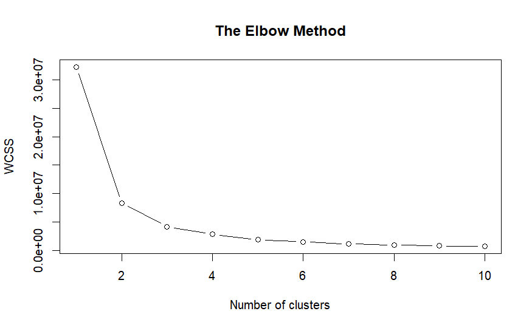
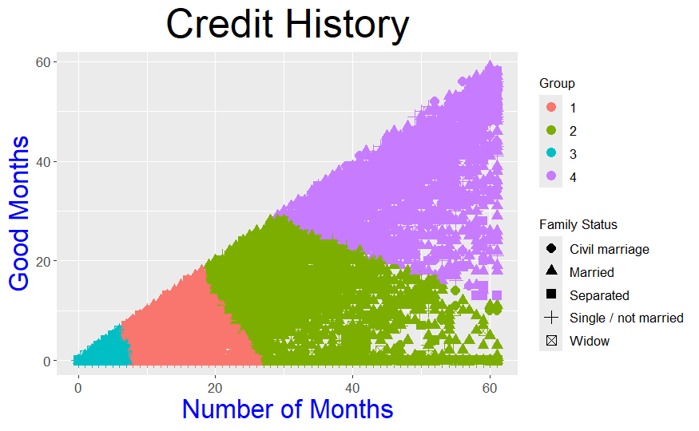
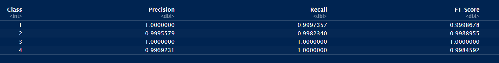

# CreditCard_ApprovalPrediction
The project is written using the programming language R and in this repository two things are being approached. (1) Clustering to group different clients that have a total number of months vs good months in their credit history and (2) Logistic Regression (classifier) to predict if a new customer based on important features that were used to train the model will be either a good borrower or not. The dataset was obtained from Kaggle (https://www.kaggle.com/datasets/rikdifos/credit-card-approval-prediction/data).

## Clustering ##
K-means is used here as the clustering method and it was shown that the number of clusters that would be sufficient for this model is 4 using the elbow method

📌 Credit History Clusters & Risk Levels:

1️⃣ 🔴 Cluster 1 (Red, Short Credit History) → Moderate-Risk Borrowers
- Borrowers with a short credit history (~5-25 months) but a strong record of timely payments.
- Typically young borrowers or new credit holders establishing their financial profiles.
  
2️⃣ 🟢 Cluster 2 (Green, Mid-Length Credit History) → Medium to High-Risk Borrowers
- Credit history ranges from ~20 to 60 months.
- Medium-Risk Borrowers: Those with ~20 to ~50 months tend to have an equal balance of good months and total months, making them moderately risky.
- High-Risk Borrowers: Those with 50+ months but fewer good months have a higher likelihood of credit rejection.
  
3️⃣ 🔵 Cluster 3 (Cyan, Very Short Credit History) → Low-Risk Borrowers
- Borrowers with very limited credit history (~0-8 months) but a consistently good payment record.
- Generally considered low risk, with a high likelihood of credit approval.
  
4️⃣ 🟣 Cluster 4 (Purple, Mid-to-High Credit History) → Variable Risk Borrowers
- Credit history spans ~30 to 60 months, leading to varied risk levels.
- Risk is determined by the number of good months:
  - Low-Risk Borrowers: Those with ~60 months of credit history and a high number of good months remain low risk.
  - High-Risk Borrowers: Those with ~60 months but fewer good months may be at risk of credit rejection.

🚀 Summary of Risk Levels:

✅ Short but good credit history → More likely to be approved.

❌ Long history with many bad months → Higher rejection risk.

⚠️ Medium-length credit history → Risk depends on payment patterns.

## Classifier ##
For the classifer method, Logistic Regression was used and it was shown that the model trained had a high accuracy of almost 100% with high values of recall and f-1 sccore for the four different groups

